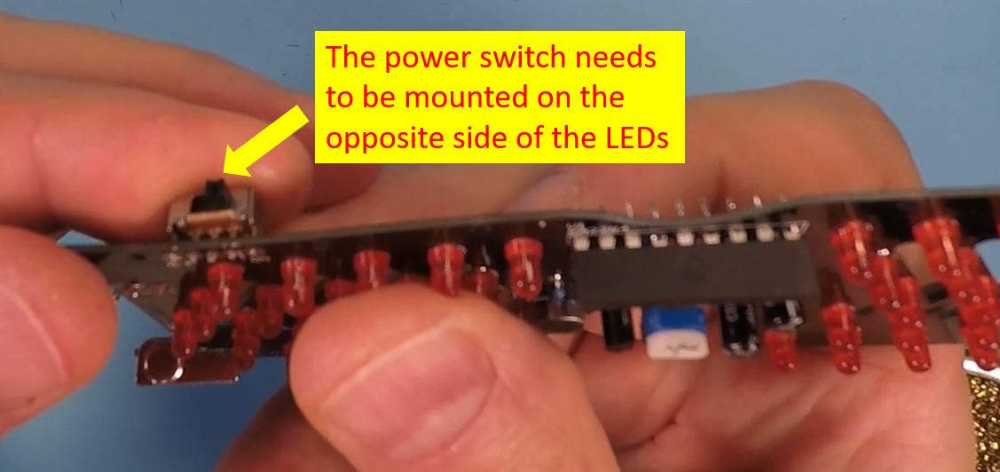
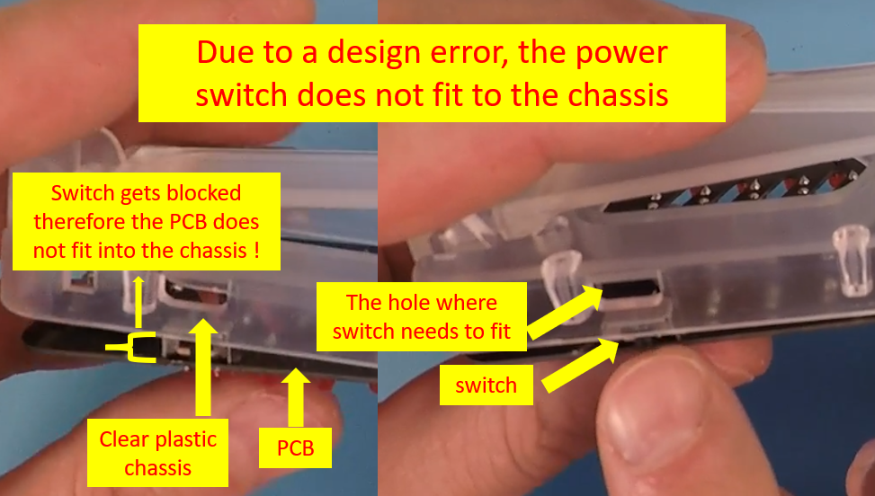
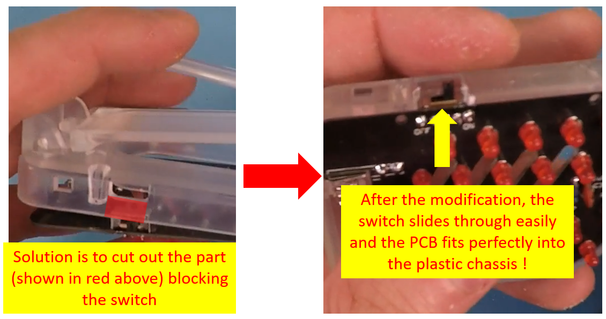
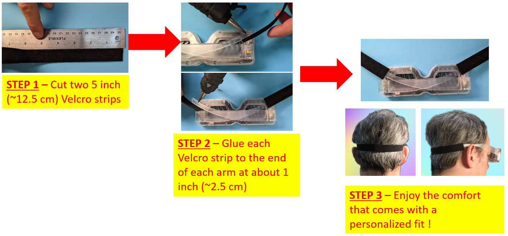

# Project: Sound sensitive LED glasses

# ID:23109
---
This project is one of the most fun ones so far. It is a fantastic kit with 50 LEDs and a cool clear plastic chassis. It is a wearable device that you can actually use when going to a party to impress your friends. These glasses will look best when there is little light in the environment so the animated LEDs look their best. Another cool feature is the LEDs will light up depending on how much sound there is in the environment. You can also adjust the sensitivity to sound very easily by tuning a dial on the glasses.

One great thing about this kit is it comes with excellent documentation that describes every step of the build ! **[Here is the link to the technical guide][1]**. You cannot go wrong with this one.

Following is the link to the product page in case you would like to get one of these cool glasses to build for yourself. It can also make an excellent gift for someone you care about ;)

**[Click here to buy the sound activated LED glasses kit][2]**

If you build this project, please share your thoughts and suggestions with the rest of circuitapps community in the comments section of **[our YouTube video][3]**. Also, please feel free to talk about any interesting modifications you decide to make to this glasses as well, if any !

## Project Challenges
This is an easy circuit to build even though there are quite a few parts to solder (i.e., 50 small LEDs need to be mounted on the board !) However, while building this project watch out for the positioning of the power switch as shown below. The switch can fit on either side of the PCB therefore it is easy to make an error. Following illustrates the correct placement of the switch during the build process.

## Useful tips

### **Tip 1 - Switch placement on the plastic chassis**
While building the kit, we noticed that due to a design/manufacturing error, after soldering the switch to the PCB, it would prevent the PCB from fitting into the plastic chassis as shown below.

You may or may not experience the above problem yourself but following is a quick and easy fix we used in case you do !

### **Tip 2 - Velcro strap for a better fit**

After wearing the glasses for the first time, you will notice they are heavier towards the front, which makes them a bit unstable especially when you move your head. We recommend a simple velcro attachment fix to get around this problem for a personalized fit. This fix will also allow you to move freely without worrying that the glasses may fall off ! Following are the instructions for this velcro fix. (***[Here is the link to the velcro used if you would like to buy it][4]***)

   

[1]: ./23109_ledGlasses_guide.pdf
[2]: https://amzn.to/46wxRau
[4]: https://amzn.to/3CWp3wK
[3]: https://youtu.be/e_HKrVeQot8
